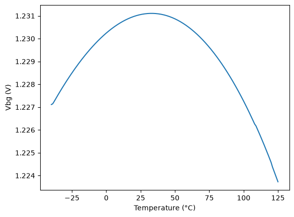

# CACE Summary for sg13cmos5l_ocd_ip__bandgap_v3

**netlist source**: schematic

|      Parameter       |         Tool         |     Result      | Min Limit  |  Min Value   | Typ Target |  Typ Value   | Max Limit  |  Max Value   |  Status  |
| :------------------- | :------------------- | :-------------- | ---------: | -----------: | ---------: | -----------: | ---------: | -----------: | :------: |
| Tempco -40 to 125 C  | ngspice              | tempco_m40_125_ppmC  |               ​ |          ​ |            ​ |          ​ |    50 ppm/°C |          ​ |   Skip 🟧    |
| Tempco 0 to 85 C     | ngspice              | tempco_m0_85_ppmC    |               ​ |          ​ |            ​ |          ​ |    25 ppm/°C |          ​ |   Skip 🟧    |
| Vbg at 27 C          | ngspice              | vbg_27               |          1.15 V |          ​ |            ​ |          ​ |        1.3 V |          ​ |   Skip 🟧    |
| V(125C) - V(-40C)    | ngspice              | vslope_mV            |               ​ |          ​ |            ​ |          ​ |         0 mV |          ​ |   Skip 🟧    |
| V(125C) - V(-40C)    | ngspice              | vslope_mV            |            0 mV |          ​ |            ​ |          ​ |            ​ |          ​ |   Skip 🟧    |

## Plots

## vbg_vs_temperature

