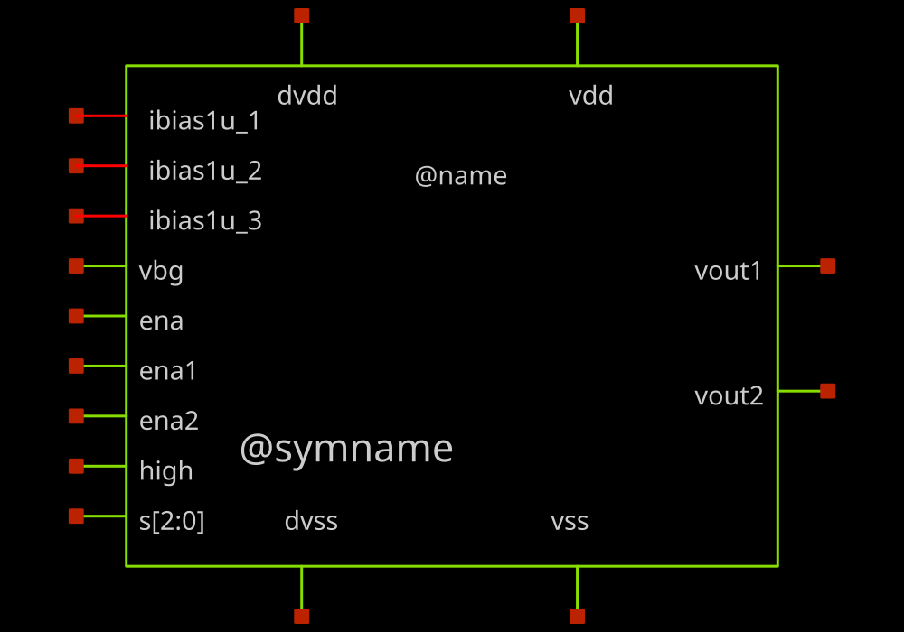
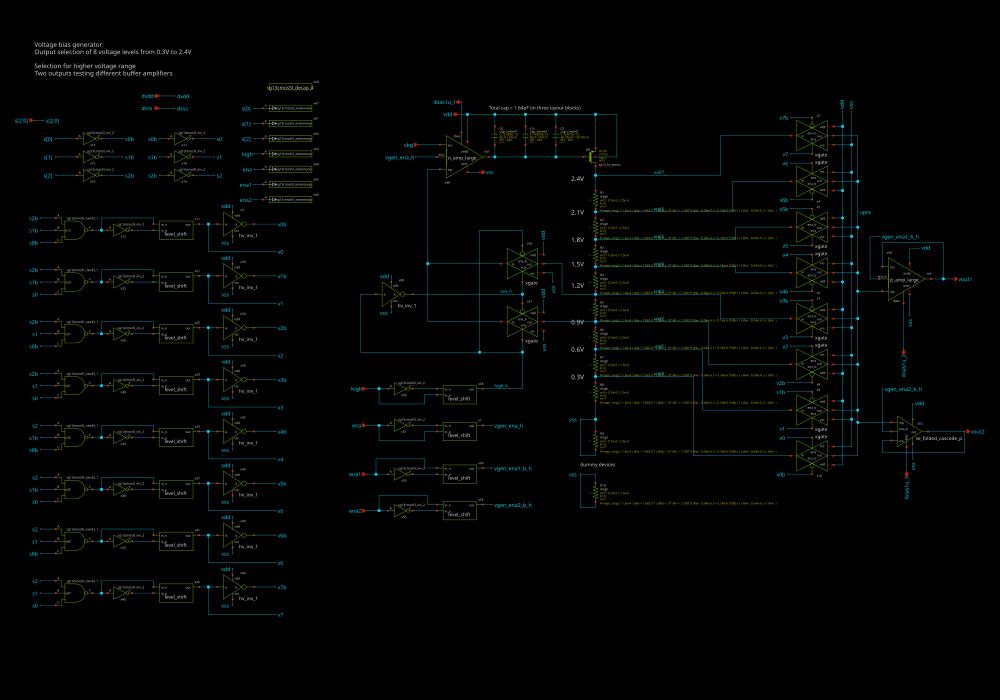

# sg13cmos5l_ocd_ip__voltgen_v2

- Description: Tapped-resistor voltage bias generator for the Chipalooza harness, with two independently enabled output buffers of different design.

- PDK: ihp-sg13cmos5l

## Authorship

- Designer: R. Timothy Edwards
- Company: Open Circuit Design, LLC
- Created: October 5, 2026
- License: Apache 2.0
- Last modified: None

## Pins

- vdd
  + Description: 3.3 V analog supply
  + Direction: inout
  + Type: power
  + Vmin: 3.0
  + Vmax: 3.6
- vss
  + Description: Analog ground
  + Direction: inout
  + Type: ground
- dvdd
  + Description: 1.2 V digital supply for ena, ena1, ena2, high and s
  + Direction: inout
  + Type: power
  + Vmin: 1.08
  + Vmax: 1.32
- dvss
  + Description: Digital ground
  + Direction: inout
  + Type: ground
- ena
  + Description: Master enable.  When 0 the pFET is off and both outputs go to ground.
  + Direction: input
  + Type: digital
- ena1
  + Description: Enable the primary output buffer (vout1)
  + Direction: input
  + Type: digital
- ena2
  + Description: Enable the secondary output buffer (vout2)
  + Direction: input
  + Type: digital
- high
  + Description: Output range select.  0 gives vbg/4 steps, 1 gives vbg/3 steps.
  + Direction: input
  + Type: digital
- s[2:0]
  + Description: Output tap select, binary, 0 to 7
  + Direction: input
  + Type: digital
- vbg
  + Description: Bandgap reference input, nominally 1.2 V
  + Direction: input
  + Type: signal
- ibias1u_1
  + Description: 1 uA bias SOURCE for the feedback amplifier (current into the pin)
  + Direction: inout
  + Type: signal
- ibias1u_2
  + Description: 1 uA bias SINK for the vout1 buffer (current out of the pin)
  + Direction: inout
  + Type: signal
- ibias1u_3
  + Description: 1 uA bias SINK for the vout2 buffer (current out of the pin)
  + Direction: inout
  + Type: signal
- vout1
  + Description: Output of the p_amp_large buffer
  + Direction: output
  + Type: signal
- vout2
  + Description: Output of the se_folded_cascode_p buffer
  + Direction: output
  + Type: signal

## Default Conditions

- corner
  + Display: Corner
  + Description: MOS process corner
  + Typical: tt
- corner_res
  + Display: Resistor corner
  + Description: Resistor corner.  This one matters more here than in most blocks: the output voltage is set by ratios along a tapped rhigh chain, so the RATIO tracks but the absolute value moves the chain current and with it the loop gain of the feedback amplifier.

  + Typical: typ
- corner_cap
  + Display: Capacitor corner
  + Description: MOM capacitor corner.  Left typical for the DC parameters, where capacitors are open circuits, but it bears on the settling parameter, which is the one that would show compensation trouble.

  + Typical: typ
- corner_dio
  + Display: Diode corner
  + Description: Left typical.  The only diodes in this block are antenna tie-downs on the digital control inputs.

  + Typical: tt
- temperature
  + Display: Temperature
  + Description: Ambient temperature
  + Unit: °C
  + Typical: 27
- Vdd
  + Display: Analog supply
  + Description: Nominal analog supply.  The line regulation parameter sweeps this INSIDE the testbench, from 2.9 to 3.7 V, so it is not enumerated here;  declaring it as a stepped condition would make CACE build one netlist per supply point as well.

  + Unit: V
  + Typical: 3.3
- Vdvdd
  + Display: Digital supply
  + Description: Digital supply, and the logic level for ena, high and s
  + Unit: V
  + Typical: 1.2
- Vbg
  + Display: Reference voltage
  + Description: Ideal bandgap reference presented to vbg
  + Unit: V
  + Typical: 1.2
- Ibias
  + Display: Bias current
  + Description: Magnitude of each of the three 1 uA bias currents
  + Unit: A
  + Typical: 1u
- Cload
  + Display: Load capacitance
  + Description: Stands in for the shared vbias trunk and the 18 per-slot analog_switch_small loads it drives in chipalooza_frame.

  + Unit: F
  + Typical: 1p
- Istep
  + Display: Load step
  + Description: Load current step for the settling parameter.  Kept to 100 nA because that is inside what these buffers can actually drive: they are class A at 1 uA, and the +/-1% load limit is a few hundred nA, not microamps.

  + Unit: A
  + Typical: 100n
- s
  + Display: Tap select
  + Description: Output tap, 0 to 7
  + Typical: 3
- high
  + Display: Range select
  + Description: 0 for vbg/4 steps, 1 for vbg/3 steps
  + Typical: 0

## Symbol

## Schematic

## Layout

