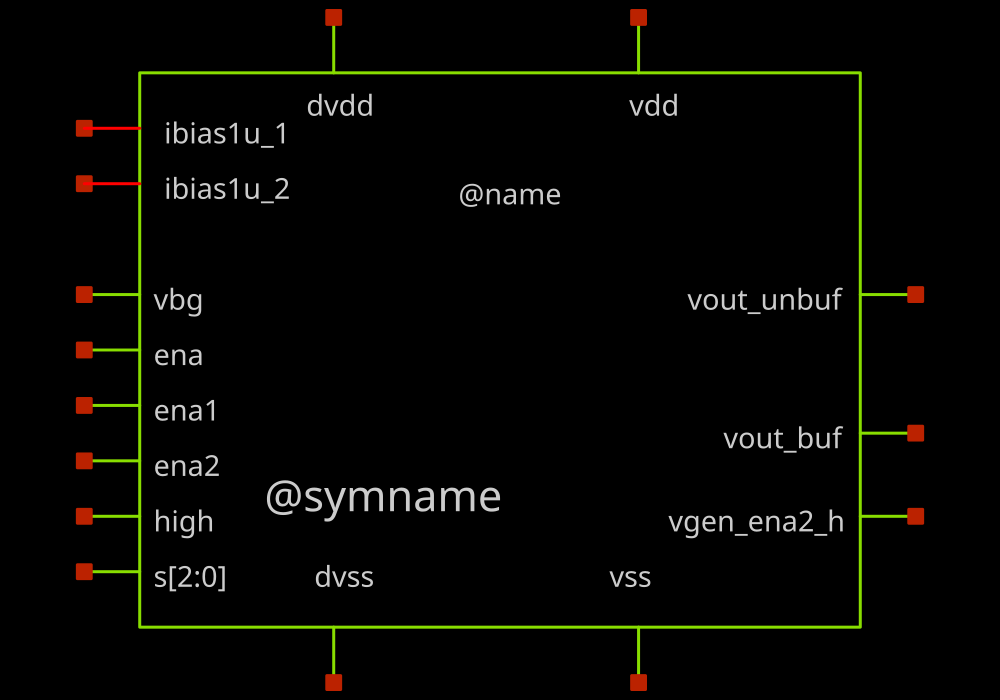
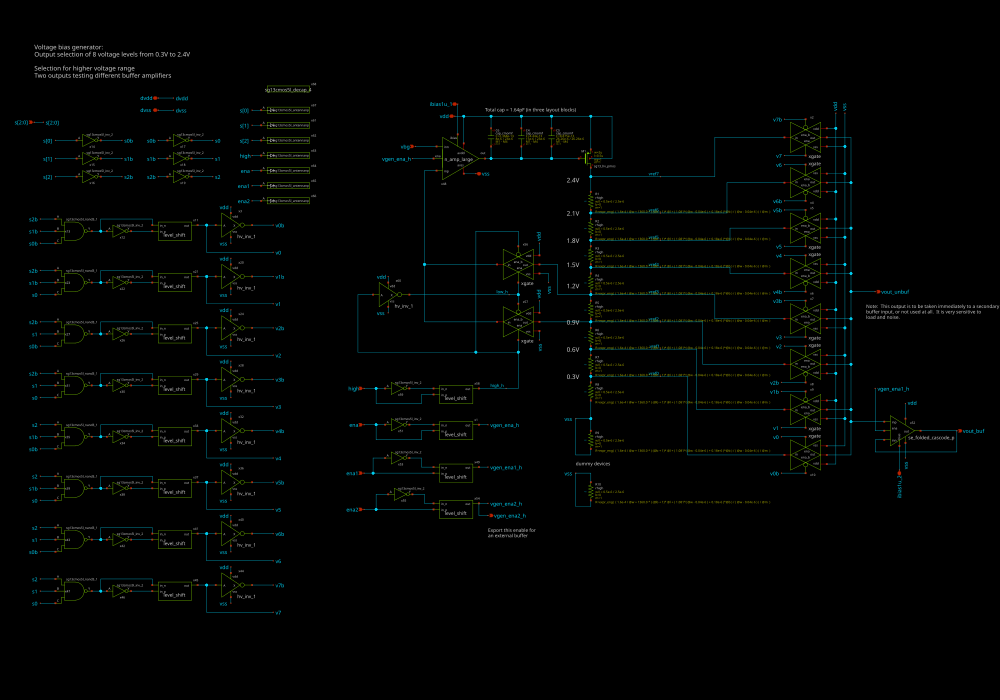

# sg13cmos5l_ocd_ip__voltgen_v3

- Description: Tapped-resistor voltage bias generator, revision 3:  one on-board folded-cascode output buffer, plus an unbuffered output taken to an external class-AB buffer that sits beside it in chipalooza_frame.

- PDK: ihp-sg13cmos5l

## Authorship

- Designer: R. Timothy Edwards
- Company: Open Circuit Design, LLC
- Created: October 6, 2026
- License: Apache 2.0
- Last modified: None

## Pins

- vdd
  + Description: 3.3 V analog supply
  + Direction: inout
  + Type: power
  + Vmin: 3.0
  + Vmax: 3.6
- vss
  + Description: Analog ground
  + Direction: inout
  + Type: ground
- dvdd
  + Description: 1.2 V digital supply for the enables and the tap select
  + Direction: inout
  + Type: power
  + Vmin: 1.08
  + Vmax: 1.32
- dvss
  + Description: Digital ground
  + Direction: inout
  + Type: ground
- ena
  + Description: Master enable, active high
  + Direction: input
  + Type: digital
- ena1
  + Description: Enable the on-board folded-cascode buffer, active high
  + Direction: input
  + Type: digital
- ena2
  + Description: Enable the external class-AB buffer, active high.  Level shifted inside this cell and exported as vgen_ena2_h.

  + Direction: input
  + Type: digital
- high
  + Description: Range select.  0 gives vbg/4 steps, 1 gives vbg/3 steps.
  + Direction: input
  + Type: digital
- s[2:0]
  + Description: Tap select, binary, 0 to 7
  + Direction: input
  + Type: digital
- vbg
  + Description: Bandgap reference input, nominally 1.2 V
  + Direction: input
  + Type: signal
- ibias1u_1
  + Description: 1 uA bias SOURCE for the feedback amplifier
  + Direction: inout
  + Type: signal
- ibias1u_2
  + Description: 1 uA bias SINK for the folded-cascode buffer
  + Direction: inout
  + Type: signal
- vout_buf
  + Description: Folded-cascode buffered output.  Tied in chipalooza_frame to the output of the external class-AB buffer.

  + Direction: output
  + Type: signal
- vout_unbuf
  + Description: Unbuffered resistor tap, taken to the external class-AB buffer. High impedance:  any load on it is an uncorrected error, since it sits outside the feedback loop that regulates the chain.

  + Direction: output
  + Type: signal
- vgen_ena2_h
  + Description: Level-shifted ena2, for the external class-AB buffer
  + Direction: output
  + Type: digital

## Default Conditions

- corner
  + Display: Corner
  + Description: MOS process corner
  + Typical: tt
- corner_res
  + Display: Resistor corner
  + Description: Matters more here than in most blocks:  the output is set by ratios along a tapped rhigh chain, so the ratio tracks but the absolute value moves the chain current and the loop gain with it.

  + Typical: typ
- corner_cap
  + Display: Capacitor corner
  + Description: MOM capacitor corner
  + Typical: typ
- corner_dio
  + Display: Diode corner
  + Description: Antenna tie-downs on the digital inputs only
  + Typical: tt
- temperature
  + Display: Temperature
  + Unit: °C
  + Typical: 27
- Vdd
  + Display: Analog supply
  + Unit: V
  + Typical: 3.3
- Vdvdd
  + Display: Digital supply
  + Unit: V
  + Typical: 1.2
- Vbg
  + Display: Reference voltage
  + Description: Ideal bandgap reference presented to vbg
  + Unit: V
  + Typical: 1.2
- Ibias
  + Display: Feedback amp bias
  + Description: Bias SOURCE into ibias1u_1.  Plain numeric rather than 1u because bracket expressions go through safe_eval, which reads 1u as a malformed Python literal rather than a SPICE suffix.

  + Unit: A
  + Typical: 1e-6
- Ibias2
  + Display: Cascode buffer bias
  + Description: Bias SINK from ibias1u_2.  Set to 0 when ena1 is 0.
  + Unit: A
  + Typical: 1e-6
- Ibias3
  + Display: Class-AB buffer bias
  + Description: Bias SINK from the class-AB buffer.  Set to 0 when ena2 is 0.
  + Unit: A
  + Typical: 1e-6
- Ena
  + Display: Master enable
  + Typical: 1
- Ena1
  + Display: Cascode buffer enable
  + Typical: 1
- Ena2
  + Display: Class-AB buffer enable
  + Typical: 1
- Cload
  + Display: Load capacitance
  + Description: Stands in for the shared vbias trunk and its 18 slot switches
  + Unit: F
  + Typical: 1p
- s
  + Display: Tap select
  + Typical: 3
- high
  + Display: Range select
  + Typical: 0

## Symbol

## Schematic

## Layout

